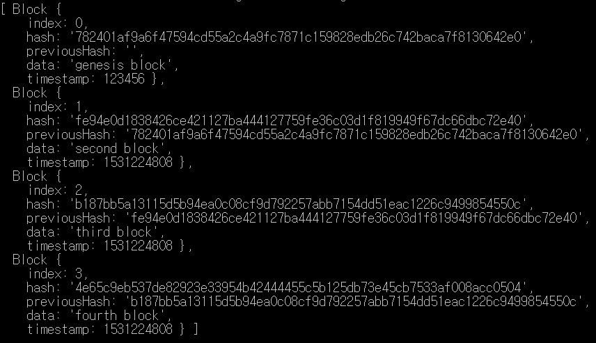

# typeChain
Learning Typescript by making a Blockchain with it

## Running this project

```
$ yarn
$ yarn start
```

## Screenshot




## 정리
##### 18-07-09

> Typescript 설치 :  `yarn global add typescript`

> tsconfig.json : typescript에게 어떻게 javascript로 변환할지.
>
> 변환 : (windows) yarn run tsc

> function 파라미터에 arguments optional 설정 : 파라미터 뒤에 ? 붙이기 (없으면 undefined)
>
> 파라미터, 함수리턴타입 지정 가능

>tsc-watch : 변경될 때마다 자동으로(약간 nodemon같은 역할인듯)


##### 18-07-10

> interface : js로 컴파일x  -> class

https://academy.nomadcoders.co/p/build-a-blockchain-with-typescript